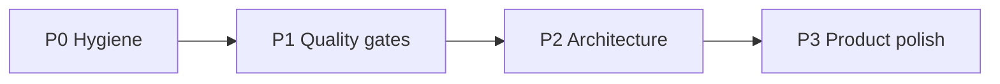

# Maturity roadmap — ha-dashboard

**Aanname:** personal Home Assistant kiosk-dashboard (tablet). Focus = engineering hygiene + production gates eerst; product polish daarna. Geen multi-tenant / shareable product scope.

**Huidige staat (kort):** Bun + Vite 8 + React 19 + `@hakit` SPA (~2k LOC). Husky + oxlint + Renovate aanwezig. Geen CI, geen Docker/hosting-config in repo, `strict` uit, 2 unit tests, unused deps (`zustand`, `express`, `cors`, …), LLT in client (`VITE_HA_LONG_LIVED_TOKEN`), hardcoded entity IDs, Vacuum is scaffold.

---

## P0 — Hygiene (1–2 sessies, laag risico)

Stop rot; maak de dependency/type-baseline eerlijk.

| Actie                       | Waarom                                                  | Waar                                                                                                                                           |
| --------------------------- | ------------------------------------------------------- | ---------------------------------------------------------------------------------------------------------------------------------------------- |
| Unused deps eruit           | Noise + false security surface                          | [`package.json`](package.json): `zustand`, `express`, `cors`, `dotenv`, waarschijnlijk `jsdom`/`global-jsdom`/`ts-node`/`url` als unused       |
| `@hakit/*` → `dependencies` | Runtime imports in [`App.tsx`](src/App.tsx), components | Nu foutief in `devDependencies`                                                                                                                |
| Stale leftovers             | Dode types/aliases                                      | [`CalendarCard/global.d.ts`](src/components/molecules/CalendarCard/global.d.ts), `@fullcalendar` aliases in [`vite.config.ts`](vite.config.ts) |
| `strict: true` aanzetten    | Volwassen TS-baseline                                   | [`tsconfig.json`](tsconfig.json) — fix `ErrorPage` `error: any` e.d.                                                                           |
| Env validatie bij boot      | Fail-fast i.p.v. silent undefined                       | Zod schema voor `VITE_*` (zelfde patroon als [`src/api/weather/schema.ts`](src/api/weather/schema.ts)), aanroepen vanuit `main`/`App`          |
| README sync                 | Deploy + scripts documenteren                           | [`README.md`](README.md) is nu alleen env                                                                                                      |

**Klaar als:** `bun run type-check` + `lint` + `build` groen met strict; `package.json` zonder dode deps.

---

## P1 — Quality & production gates (hoogste leverage)

Lokale husky-gates bestaan; remote/CI en deploy niet.

### CI (GitHub Actions)

Workflow op PR + main:

1. `bun install --frozen-lockfile`
2. `lint` + `type-check`
3. `test` (+ coverage upload optioneel)
4. `build` — **let op:** `prebuild` → [`sync-types.ts`](sync-types.ts) heeft live HA nodig. Oplossing: CI-build met gecachte/committed `supported-types.d.ts`, of `sync-types` alleen lokaal/pre-release; build-script splitsen (`build:ci` zonder sync).

### Deploy

Git-historie noemt Cloudflare; geen wrangler in repo. Concrete keuze: **Cloudflare Pages** (static `dist/`, `base: './'` past).

- Pages project + preview deploys op PR
- Secrets als CF env vars (`VITE_*` op build-time — acceptabel voor personal LAN/VPN dashboard; zie P2 voor LLT)

### Tests (minimum bar)

Nu: 2 bestanden / 3 cases ([`Card.test.tsx`](src/components/atoms/Card/Card.test.tsx), [`TileButton.test.tsx`](src/components/atoms/TileButton/TileButton.test.tsx)).

Toevoegen (geen E2E nodig in P1):

- Pure utils: [`formatCurrency`](src/utils/), [`formatDecimal`](src/utils/), [`getDayName`](src/utils/)
- Weather: Zod schema + `fetchWeather` met MSW of `fetch` mock
- Coverage thresholds in Vitest (bijv. utils + api ≥ 80%; components later)

### Query defaults

[`App.tsx`](src/App.tsx) `new QueryClient()` zonder defaults → expliciete `staleTime` / `retry` / error handling policy.

**Klaar als:** elke PR runt lint/typecheck/test/build; main deployt automatisch naar Pages preview/prod.

---

## P2 — Architecture & maintainability

Maakt features goedkoper en veiliger.

### Entity config i.p.v. hardcodes

Entity IDs verspreid over [`Home.tsx`](src/routes/Home/Home.tsx), [`useActiveMediaPlayer.ts`](src/utils/useActiveMediaPlayer.ts), [`CalendarCard.tsx`](src/components/molecules/CalendarCard/CalendarCard.tsx), [`useEnergyTariffs.ts`](src/routes/Energy/useEnergyTariffs.ts), [`Sidebar.tsx`](src/components/organisms/Sidebar/Sidebar.tsx).

- Centraal `src/config/entities.ts` (of JSON) met typed keys
- Optioneel later: env/override file — YAGNI tot tweede HA-instance

### Calendar auth: LLT uit de browser

Nu: Bearer token in client via `VITE_HA_LONG_LIVED_TOKEN` ([`CalendarCard.tsx`](src/components/molecules/CalendarCard/CalendarCard.tsx)). Token zit in de JS-bundle.

Voor personal tablet achter auth/VPN: acceptabel risico, maar "volwassen" = token niet in frontend:

- Kleine proxy (CF Worker of HA ingress) die calendar REST proxiet met server-side token, **of**
- Alleen hakit websocket/`callApi` via bestaande HassConnect-sessie als dat voldoende rechten geeft (onderzoek eerst — voorkeur als het werkt zonder extra infra)

### Atomic design opschonen

- [`WeatherCard`](src/components/atoms/WeatherCard/WeatherCard.tsx) fetcht data → molecule, niet atom
- Molecules missen barrels (alleen atoms hebben [`index.ts`](src/components/atoms/index.ts))
- Layout: hardcoded `h-[700px]` in [`Root.tsx`](src/routes/Root.tsx) → CSS var / viewport-aware

### React Query als enige app-data laag

Geen Zustand nodig (verwijder in P0). Calendar + weather al op RQ; houd dat patroon.

**Klaar als:** entity IDs op 1 plek; calendar zonder client-LLT (of bewust gedocumenteerde uitzondering); component-lagen kloppen.

---

## P3 — Product & UX polish (lager, na gates)

| Item                | Note                                                                                                                |
| ------------------- | ------------------------------------------------------------------------------------------------------------------- |
| Vacuum page         | [`Vacuum.tsx`](src/routes/Vacuum/Vacuum.tsx) is hakit scaffold — of bouwen of route verwijderen                     |
| a11y basis          | `alt` op media art, keyboard/focus op clickable `Card`/`MediaCard` icons, geen SVG-only click targets zonder button |
| Locale consistentie | Mix NL/EN (`nl-NL` utils vs Engelse day names / "Loading…") — één locale (`nl`) of simpele `t()` map                |
| Error UX            | [`ErrorPage`](src/routes/ErrorPage/ErrorPage.tsx) typeren + HA disconnect/toast policy                              |
| Observability       | Alleen als je remote debugt: Sentry browser SDK; anders skip (personal kiosk)                                       |
| E2E                 | Playwright smoke (home laadt, sidebar nav) — pas na stabiele CI                                                     |

**Niet doen (YAGNI voor dit project):** i18n-framework, theme toggle, design system extract, microfrontends, Zustand, Express-backend in dezelfde repo.

---

## Voorgestelde volgorde (concrete sprints)

1. **Sprint A (P0):** deps cleanup + strict + env Zod + README
2. **Sprint B (P1):** CI workflow + build/sync-types split + CF Pages
3. **Sprint C (P1):** utils/weather tests + QueryClient defaults + coverage floor
4. **Sprint D (P2):** `config/entities.ts` + WeatherCard layer fix + LLT-strategie
5. **Sprint E (P3):** Vacuum of kill; a11y + locale pass

---

## Success metrics

- PR zonder lokale machine: CI groen verplicht
- `tsc --strict` clean
- Zero unused runtime deps
- ≥1 meaningful test per utils/api module
- Entity IDs niet meer verspreid over pages
- Deploy reproduceerbaar vanaf main (CF Pages)
